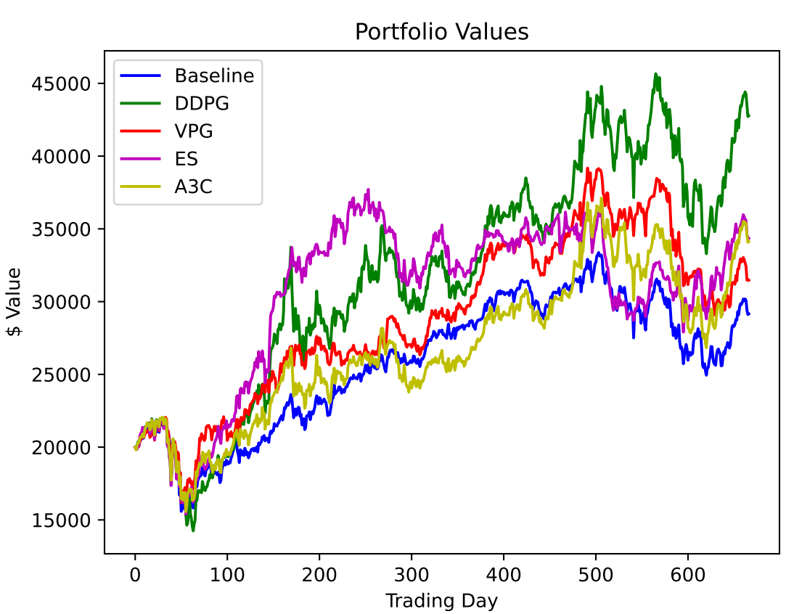

# Stock Market Trading with Deep RL

This project benchmarks the VPG, A3C, ES and DDPG algorithms for the task of stock market trading.

## Description

This repo implements VPG, A3C, ES and DDPG algorithms using PyTorch. A stock environment is also implemented which follows the OpenAI Gym interface, 
so new RL algorithms can be benchmarked using the environment. The RL algorithms can be trained on the stock environment with an initial Bayesian optimisaiton
step for hyperparameter tuning. Results on test environment are below:

|               | Initial Portfolio Value | Final Portfolio Value   | Annualised Return  | 
| ------------- | ------------------------| ------------------------| -------------------|
| DDPG          | $20,000                 | $42,776                 | 33.32%             |
| ES            | $20,000                 | $34,349                 | 22.70%             |
| A3C           | $20,000                 | $34,131                 | 22.40%             |
| VPG           | $20,000                 | $31,472                 | 18.71%             |
| Baseline      | $20,000                 | $29,154                 | 15.32%             |

## Getting Started

### Dependencies

* Python 3.9
* Libs in requirements.txt

### Installing

* pip install -r requirements.txt
* may have a problem installing talib package. Check this article if so: https://rohan09.medium.com/how-to-install-ta-lib-in-python-86e4edb80934

### Executing program

* python -m run_trading_experiments
* To retrain the models, delete the files in the stock_env folder (but not the contained folders), then run the above command. It will take around 3 days to train each model (most of the time is for automatic hyperparameter tuning.)
* You can play around with different dates for training, validation and testing, use different tickers and set hyperparameters in the run_trading_experiments.py file.

## License

This project is licensed under the Apache License - see the LICENSE.md file for details
